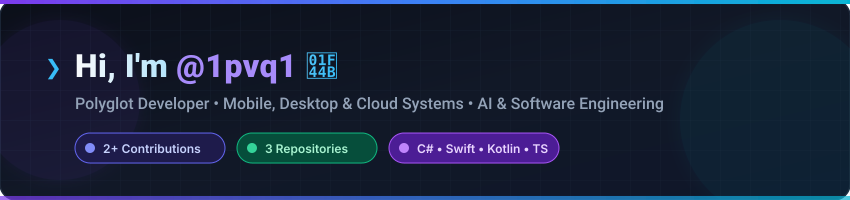
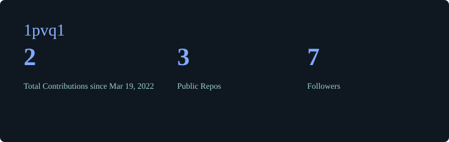
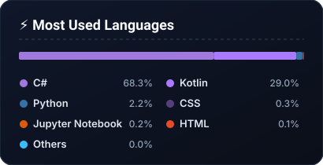
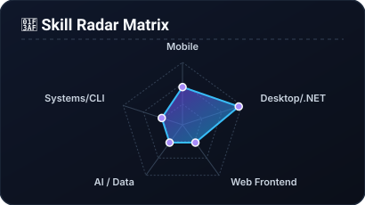
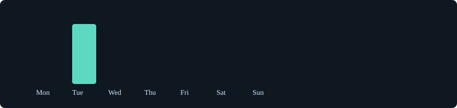

<div align="center">
  <!-- Header Hero Banner SVG -->
  
</div>

<br/>

<div align="center">

  <!-- Dynamic Animated Badges & Status Pills -->
  <a href="https://github.com/1pvq1">
    
  </a>
  <a href="https://github.com/1pvq1">
    
  </a>
  <a href="https://github.com/1pvq1">
    
  </a>

</div>

---

## ⚡ About Me

<table border="0">
  <tr>
    <td width="50%" stroke="none">

```gcode
101010101010101010101010101010101010101010
01   __   ____   __     __   ___    __  10
01  /  | |  _ \  \ \   / /  / _ \  /  | 10
01  |  | | |_) |  \ \ / /  | | | | |  | 10
01  |  | |  __/    \ V /   | |_| | |  | 10
01  |__| |_|        \_/     \__\_\ |__| 10
101010101010101010101010101010101010101010
```

  </td>
<td width="50%">

- 🔭 **Currently Building**: Cross-platform desktop/mobile solutions & native tools.
- 🌱 **Exploring**: Advanced AI architectures, high-performance systems & modern graphics.
- 💬 **Ask Me About**: `C# / .NET`, `Python`, `Kotlin`, `TypeScript`, `Swift`.
- ⚡ **Fun Fact**: Polyglot code bases fuel creative problem-solving across platforms!
- 📫 **Reach Out**: Feel free to explore repositories or collaborate on open-source projects.

    </td>
  </tr>
</table>

---

## 🛠️ Technology Stack

<div align="center">

### 📱 Mobile & Desktop Native
<p>
  
  
  
  
  
</p>

### 🤖 AI, Data & Python Ecosystem
<p>
  
  
  
  
  
  
</p>

### 🌐 Web & Fullstack Development
<p>
  
  
  
  
  
  
</p>

### 🐧 Systems, DevOps & Tools
<p>
  
  
  
  
  
</p>

</div>

---

## 📈 Data Visualizations & Analytics

<div align="center">

  <!-- Overview Stats & Top Languages Grid -->
  <table border="0">
    <tr>
      <td>
        
      </td>
      <td>
        
      </td>
    </tr>
  </table>

  <!-- Contribution Streak Meter -->
  <br/>
  
  <br/><br/>

  <!-- Skill Radar Matrix & Activity Breakdown Grid -->
  <table border="0">
    <tr>
      <td>
        
      </td>
      <td>
        
      </td>
    </tr>
  </table>

</div>

---

<div align="center">
  <sub>⚡ Visualizations automatically computed &amp; generated via Python (Conda <code>dev312</code>) and GitHub GraphQL API</sub>
</div>
